# Library

Readme for the atomic and coupled EB-DEVS models.

## EB-DEVS Coupled Models

### Multi-Robot System

The _MultiRobotSystem_ EB-DEVS coupled model is the top coupled model. It consists of $N$ _Robot_ EB-DEVS coupled models (Section [Robot](#robot)), each with bidirectional links to the _Transmission Medium_ EB-DEVS atomic model (Section [Transmission Medium](#transmission-medium)), see **Figure 1**.

The global state of the _MultiRobotSystem_ coupled model, updated upon receiving information from the _Robots_ through the $Y_{Gup}$ ports, is the dictionary 
$$
    S_G = \langle \ldots, \; \texttt{<id>} = \langle \texttt{<time>}, \; \texttt{<state>}, \; \texttt{<comm\_range>} \rangle, \; \ldots \rangle,
$$
where `id` identifies the robot, `time` denotes the time of the last update received, `state` comprises the _QSS_ polynomials representing the dynamical state of the robot (Section [Robot Dynamics](#robot-dynamics)), and `comm_range` the communication range. 

During initialization, the _MultiRobotSystem_ loads configuration parameters from a `json` file containing individual dictionaries for each robot. These parameters, include `id` and other configuration variables of the atomic models detailed in Sections [Dynamics Function](#dynamics-function) through [Trasmission Medium](#transmission-medium), and are subsequently distributed to their respective coupled and atomic children models.

---

**Figure 1. Multirobot Coupled**

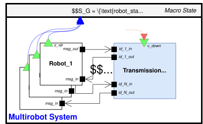

### Robot

The _Robot_ EB-DEVS coupled model includes atomic models for subsystems typically used in multi-robot applications. This coupled model has one input port (`msg_in`) and one output port (`msg_out`) indicating the ports for communication with other robots.
The global state of the _Robot_ coupled model, updated when receiving information from _Robot Dynamics_ through the $Y_{Gup}$ ports, is the dictionary 
$$
    S_G = \langle \texttt{<id>}, \texttt{<time>}, \; \texttt{<state>}, \; \texttt{<comm\_range>} \rangle.
$$

A generic _Robot_ configuration is shown in **Figure 2**, including the coupled model _Robot Dynamics_ (Section [Robot Dynamics](#robot-dynamics)), and atomic models like _Localization_, _Control_, _Coordination_, _Communication_, _Interoceptive Sensor_, and _Exteroceptive Sensor_ (Sections [Dynamics Function](#dynamics-function) through [Transmission Medium](#transmission-medium)).

---

**Figure 2. Robot coupled**

| (a) Robot Coupled. | (b) Robot Coupled Overview. |
|-------------------------------------|-------------------------------------|
| 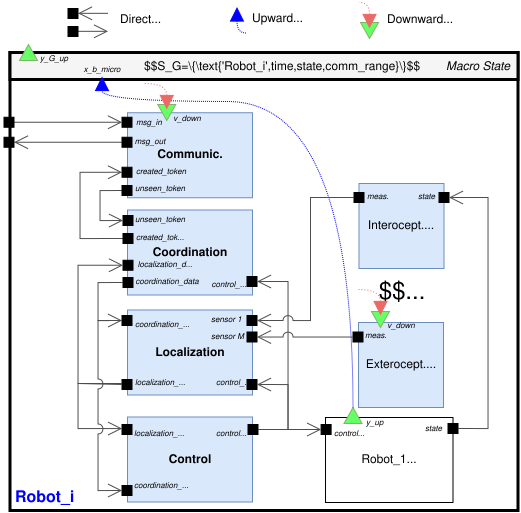 | 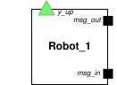 |

### Robot Dynamics

The _Robot Dynamics_ EB-DEVS coupled model is used to numerically approximate the integral equation  that models the robot dynamics, $\mathbf{x}_i(t) = \mathbf{x}_i(0) + \int_0^t f_i(\mathbf{x}_i(\tau), \mathbf{u}_i(\tau)) \mathrm{d}\tau$, where $\mathbf{x}_i \in \mathbb{R}^{d_x}$ denotes the state of the robot $i$, $\mathbf{u}_i \in \mathbb{R}^{d_u}$ its control input and $f_i: \mathbb{R}^{d_x} \times \mathbb{R}^{d_u} \to \mathbb{R}^{d_x}$ the dynamics function.

This atomic includes the _Dynamics Function_ atomic (Section [Dynamics Function](#dynamics-function)), $d_x$ _multilevel QSS Integrators (mQSSI)_ (Section [QSS](#qss-integrator-and-multilevel-qss-integrator)), a _Splitter_ and a _Merger_ atomic model (Section [Splitter and Merger](#splitter-and-merger)) and the appropriate interconnections, see **Figure 3**.

The global state of the _Robot Dynamics_ coupled model, updated when receiving information from the _mQSSI_ through the $Y_{Gup}$ ports, is the dictionary 

$$
    S_G = \langle \texttt{<time>}, \; \texttt{<state>} \rangle,
$$

where `<state>` comprises one _QSS_ polynomial segment for each of the $d_x$ state variables.

---

**Figure 3. Robot Dynamics Coupled**

| (a) Robot Dynamics Coupled. | (b) Robot Dynamics Coupled Overview. |
|-------------------------------------|-------------------------------------|
| 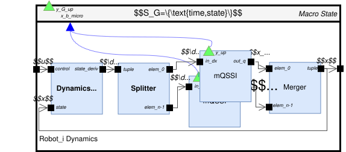 | 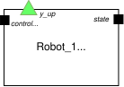 |

## EB-DEVS Atomic Models

The atomic models in this library are designed to closely represent common components in multi-robot systems. To ensure generality, they support all possible input/output signals, though not all need to be used in every application. Their design enables computing the outputs through calls to external functions during both internal and external transitions. This fosters re-usability and adaptability, which are key for developing different control strategies. 
To simplify the following description, atomic models that start passivated (time advance equal to infinity) and trigger an output event in zero time only when they receive an input event, before returning to passive, are called _reactive_. The remaining atomic models schedule internal transitions recurrently, either regardless of the value of the incoming events or based on their values.

### Dynamics Function

The _Dynamics Function_ EB-DEVS atomic model is a reactive model that implements the mapping $f_i: \mathbb{R}^{d_x} \times \mathbb{R}^{d_u} \to \mathbb{R}^{d_x}$. It includes two input ports (`state` and `control`) and one output port (`state_deriv`) each handling a list of the corresponding length.

---

**Figure 4. Dynamics Function Atomic**

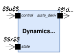

### QSS Integrator and multilevel QSS Integrator

The family of Quantized State System integration methods (_QSS_) can naturally be represented using the DEVS formalism [(Kofman and Junco 2001)](https://dl.acm.org/doi/10.5555/609891.609893). The integrated value is approximated by a sequence of polynomial segments valid between consecutive events. The _QSS_ Integrator (_QSSI_) DEVS atomic model has one input port `dx` for the time derivative $\dot{x}$, one output port `q` for the quantized _QSS_ polynomial $q$ that approximates the time evolution of $x$, and the internal state $s$ is given by the tuple $\langle x, u, i, \sigma \rangle$ (for further details see [(Kofman and Junco 2001)](https://dl.acm.org/doi/10.5555/609891.609893)). Although the _QSSI_ atomic implemented here is first-order QSSI, the library represents $q$ as a degree-$10$ polynomial to accommodate future implementations of higher-order _QSSI_. This atomic model was then extended using EB-DEVS to communicate the polynomial $q$ to the parent model using the indirect communication channel $Y_{up}$. The formal definition of the _multilevel QSS Integrator_ (_mQSSI_) EB-DEVS atomic model is given by: 

$$
\begin{aligned}
mQSSI = \bigl\langle & X \in \mathbb{R}, \;
Y \in \mathbb{R}, \;
S \in \mathbb{R} \times \mathbb{R} \times \mathbb{Z} \times \mathbb{R}_{0}^{+}, \\
& Y_{up} \in \mathbb{R} \times \mathbb{R}_{0}^{+}, \;
S_{macro} \in \emptyset, \\
& \delta_{int}(s) = \left(s^{\prime} = \langle x+\sigma\cdot u,u, i+\text{sign}(u),\sigma^{\prime} \rangle, \; Y_{up}=\langle q, t\rangle \right), \\
& \delta_{ext}(s,e,x) = \left(s^{\prime} = \langle x+e\cdot u,v, i,\sigma^{\prime\prime} \rangle, \; Y_{up}=\langle q, t\rangle\right), \\
& \lambda(s) = y = q = d_{i+\text{sign}(u)}, \;
ta(s) = \sigma \bigr\rangle
\end{aligned}
$$

with $\sigma^{\prime}$ and $\sigma^{\prime\prime}$ defined as in [(Kofman and Junco 2001)](https://dl.acm.org/doi/10.5555/609891.609893). With every change in the atomic state $s$, during the internal and external transition functions $\delta_{int}$ and $\delta_{ext}$, an output event is communicated to the parent model via the $Y_{up}$ carrying both the polynomial for the quantized state $q$ and the current time $t$. The _mQSSI_ atomic model has four parameters: the relative quantum `dQRel`, the minimum quantum `dQMin`, the input gain `gain` and the initial condition `x0`.

---

**Figure 5. QSS Integrator and Multilevel QSS Integrator Atomic**

| (a) QSS Integrator Atomic. | (b) Multilevel QSS Integrator Atomic. |
|-------------------------------------|-------------------------------------|
| 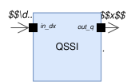 | 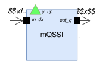 |

### Splitter and Merger

The complementary _Splitter_ and _Merger_ EB-DEVS atomic models perform reactive splitting and merging of lists of any data type. A _Splitter_ receives a tuple with $n$ elements on its `tuple` port and emits $n$ simultaneous outputs on ports `elem_<i>` ($i = 0, \ldots, n-1$), each carrying one element. Conversely, a _Merger_ has $n$ input ports (`elem_<i>`) and one output port (`tuple`). It maintains a tuple `data` indexed by port, updates the relevant entry upon receiving an input, and emits the complete tuple.

---

**Figure 6. Splitter and Merger Atomics**

| (a) Splitter Atomic. | (b) Merger Atomic. |
|-------------------------------------|-------------------------------------|
| 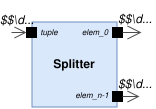 | 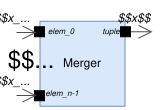 |

### Interoceptive and Exteroceptive Sensors

Typical sensors found onboard robots can be classified as interoceptive and exteroceptive. The _Interoceptive Sensor_ EB-DEVS atomic model aims to represent various types of sensors that measure variables that depend only on the robot's internal state, such as accelerometers, gyroscopes, and odometers. This atomic model contains one input port (`state`) containing the list of $d_x$ _QSS_ polynomials corresponding to the state variables which are updated with any new input event. The _QSS_ polynomial coefficients are valid between consecutive input events and can be evaluated at any time. The atomic model periodically schedules an internal transition to simulate a new measurement evaluating the _QSS_ polynomials.

The _Exteroceptive Sensor_ EB-DEVS atomic model aims to represent various types of sensors that perceive parameters which depend on external references, such as GNSS receivers, magnetometers, cameras and lidars. This atomic model possesses no input; instead, it simulates measurements by periodically retrieving information from _MultiRobotSystem_'s global state $S_G$ via the $V_{down}$ function.

Both sensor atomic models have one output port (`measurement`) which emits the list of scalar values usually corrupted with white Gaussian noise. Three configuration parameters are required: the measurement period (`<sensor_id>_period`), the noise's mean value (`<sensor_id>_bias`) and covariance matrix (`<sensor_id>_covariance`). 

---

**Figure 7. Interoceptive and Exteroceptive Sensor Atomics**

| (a) Interoceptive Sensor Atomic. | (b) Exteroceptive Sensor Atomic. |
|-------------------------------------|-------------------------------------|
| 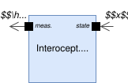 | 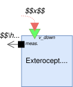 |

### Localization

The _Localization_ DEVS atomic model implements information fusion algorithms that robustly and accurately combine data from multiple sources such that each robot estimates its own state. This atomic model has $M+2$ input ports, where $M$ is the number of onboard sensors (see **Figure 8**), and might be reactive or not depending on the fusion algorithms employed. Sensor measurements are received via $M$ inputs (`<sensor\_id>`). The remaining two correspond to `coordination_data` and `control_action`, since the _Localization_ atomic may require the use of information coming from other robots and from the robot's last computed control action. This model has one output port (`localization_data`) which contains the robot's own state estimation possibly accompanied by additional data such as uncertainty measures. 

---

**Figure 8. Localization Atomic**

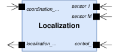

### Control

The _Control_ DEVS atomic model provides the essential tools to implement control strategies for multi-robot systems.
With this generic atomic model, a wide variety of multi-robot control schemes can be implemented. 

This atomic implements a black box for the execution of a control law that computes the actions based on two inputs: `localization_data` containing the state estimate and `coordination_data` involving information received from the other robots which, depending on the coordination strategy, might be other robots' estimated states or other relevant data. Based on these values, this atomic model periodically executes the control law and schedules an internal transition in zero time to emit the control action through its output port (`control_action`). This atomic model has the execution period (`control_period`) as a configuration parameters. If needed, when handling complex control operations, such as path planning, optimization solvers, etc., this atomic model can be replaced by the modular composition of simpler atomic models in a coupled model that maintains the same external interface (inputs and output ports).

---

**Figure 9. Control Atomic**

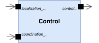

### Coordination

The algorithms for handling the exchange of data between robots in distributed control strategies are managed by the _Coordination_ DEVS atomic model. This library implements the exchange of information by the propagation of _tokens_ emitted by the robots. Each token contains

$$
    \langle \texttt{<id>}, \; \texttt{<type>}, \; \texttt{<order>}, \; \texttt{<data>}, \; \texttt{<max\_hops>}, \;\texttt{<hops>}\rangle,
$$

where `id` identifies the source robot, `type` indicates the type of information it carries, `order` determines the order in the sequence of tokens emitted by the source, `data` carries the relevant information, `max_hops` the maximum number of hops that it must traverse, and `hops` the number of hops already traversed. All token fields must remain immutable through the token's propagation except for `hops`, which starts at $1$ and gets incremented each time it is forwarded. The _Coordination_ is a reactive DEVS atomic model that is in charge of building new tokens and processing unseen incoming ones. The particular way of processing the tokens data depends on the application. In Section [Case Study](), we describe the token handling in detail for the proposed case of study. The _Coordination_ DEVS atomic model has three input ports: (`unseen_token`, `localization_data` and `control_action`); and two output ports (`coordination_data` and  `created_token`), see **Figure 10**.

---

**Figure 10. Coordination Atomic**

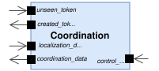

### Communication

Each robot manages its peer-to-peer communications with the _Communication_ atomic model (see **Figure 11**). This reactive atomic has two input ports (`msg_in` and `created_token`); two output ports (`unseen_token` and `msg_out`), see **Figure 11**; and a configuration parameter, `forward`, a boolean flag that determines whether the robot forwards received tokens. This atomic keeps, as part of the atomic's internal state, a double-key dictionary $\langle (\texttt{<id>}, \; \texttt{<type>}) = \texttt{<order>}\rangle$ that identifies received tokens by source and type. This dictionary is used to check if a received token has not been seen before, since forwarded tokens might arrive multiple times. Each time a token (see Section [Coordination](#coordination)) arrives at a robot via `msg_in`, the _Communication_ module outputs it through `unseen_token` if it has not been seen before; otherwise, the token is discarded. The token is forwarded through `msg_out` if $\texttt{hops} < \texttt{max\_hops}$. The _Communication_ atomic model includes the capability to store communication metrics (`comm_metrics`) when exchanging tokens with other robots. This feature simulates the measurement of metrics such as Time-of-Arrival (TOA) or Received Signal Strength Indicator (RSSI), which can be used, for example, to estimate inter-robot distances. This is implemented by retrieving information from _MultiRobotSystem_'s global state $S_G$ via the $V_{down}$ function upon the reception of a token.

---

**Figure 11. Communication Atomic**

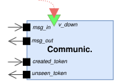

### Transmission Medium

The _Transmission Medium_ EB-DEVS atomic model simulates the physical environment through which inter-robot communication occurs.
It is designed to enable peer-to-peer communication that adapts to the dynamic topology of the multi-robot network (see **Figure 12**).
Connecting all the robots with each other requires $O(N^2)$ links, where $N$ is the total number of robots, affecting the scalability of this simulation scheme.
In contrast, the presented library connects all robots  with the _Transmission Medium_ atomic using bidirectional static links.
This approach requires $O(N)$ links, reducing the number of events and resulting in improved simulation performance. 

This reactive atomic has $N$ input ports `<id>` and $N$ output ports `<id>`.
When the _Transmission Medium_ model receives an input event carrying a token from a robot, it is routed to the neighboring robots through the corresponding output ports. 
Therefore, multiple output events are scheduled in zero time.
The event value consists of the  transmitter's `id` and the `token`.
To determine the set of neighbors, the _Transmission Medium_ queries the downward value coupling function $V_{down}: S_{G} \to S_{macro}$.
This function checks the global state $S_G$ from the top model containing the _QSS_ polynomial coefficients of the states of each robot at the current time, used to evaluate their state at the current time.

This _Transmission Medium_ atomic plays a similar role to the _Monitor_ atomic model in [(Hu et al. 2005)](https://dl.acm.org/doi/abs/10.1177/0037549705052227). However, their approach differs in that it uses the Dynamic Structure DEVS formalism to dynamically establish couplings between robots based on their distances. Unlike the _Monitor_ which is in charge of connecting/disconnecting robots, in our case, the _Transmission Medium_ is responsible for routing messages through static links with robots.

---

**Figure 12. Transmission Medium Atomic**

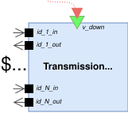

