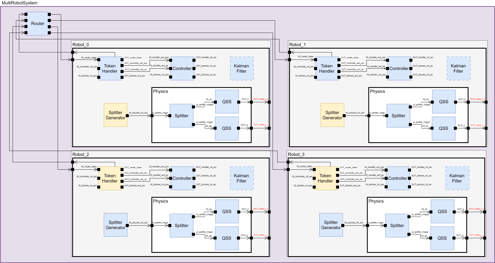

# EBD-Multirobot-Subframeworks

Model from the PhD thesis of Francisco Presenza.

## System model

The model created in `system.py` is a simple harmonic oscillator, whose equations are as follows:
```math
\dot{x}_2 = x_1 \\
\dot{x}_1 = -x_2
```

## Run an experiment

Run an experiment:
```bash
python3 experiment.py
```
The results can be found under `output/`.

## Postprocessing

The results in the `output.csv` file can be plotted with gnuplot:
```bash
cd output/
gnuplot plot.plt
```
In case, the name of the file generated by the `Collector` atomic model changes then update it in the `plot.plt` script.

## Experiment MultiRobot System Model



## Simulator
Clone the EB-DEVS Simulator with: 
```bash
git clone https://git-modsimu.exp.dc.uba.ar/elanzarotti/eb-devs.git
```
